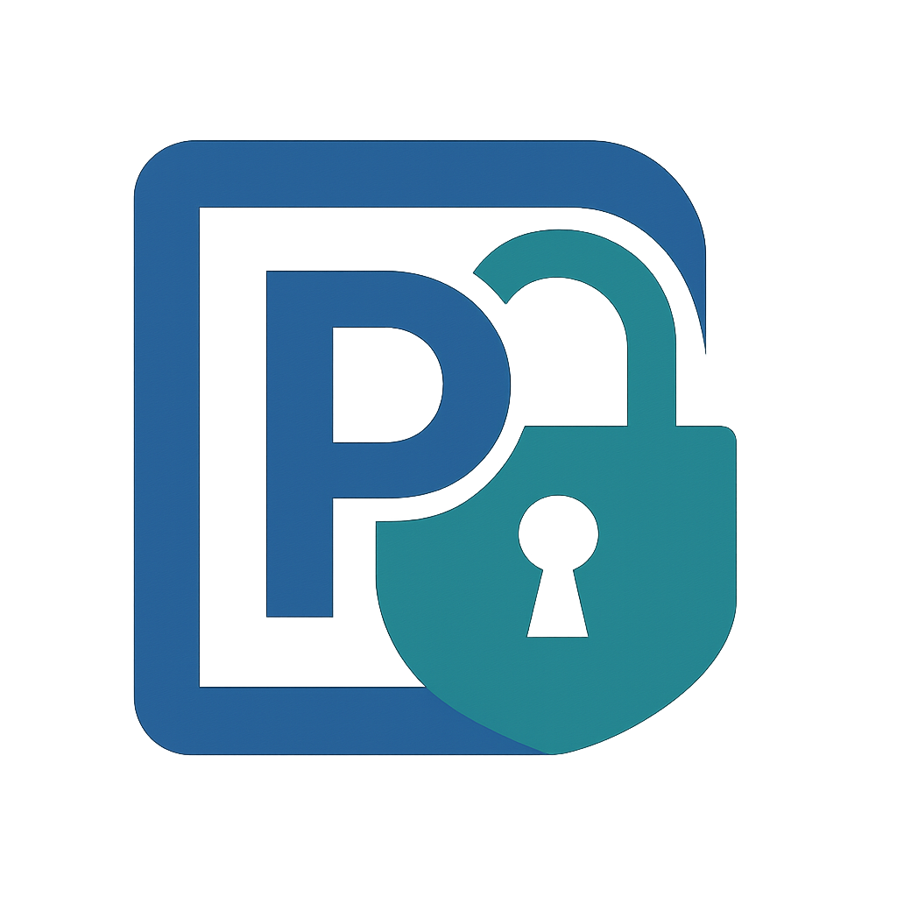

# PassOpen



**Простой, бесплатный и открытый менеджер паролей для обычных людей.**

---

## Что это такое?

PassOpen — минималистичный менеджер паролей с открытым исходным кодом, написанный на Python с использованием PySide6. Все пароли хранятся только на вашем компьютере в зашифрованном виде.  
Без подписок, без облака, без рекламы.

---

## Возможности:

- 💾 Локальное хранение паролей (ничего не отправляется в интернет)
- 🔒 Надёжное шифрование (cryptography, Scrypt, Fernet)
- 🧑‍💻 Простой интерфейс (список паролей, добавление новых записей)
- 🔐 Мастер-пароль
- 🪪 Свободная лицензия (MIT)

---

## Планы на развитие:

- [✅] Генератор паролей
- [✅] Поиск по паролям
- [✅] Экспорт/импорт в CSV
- [✅] Редактирование и удаление записей
- [✅] Копирование пароля в буфер обмена
- [✅] Поддержка тёмной темы
- [✅] Блокировка приложения
- [✅] Избранные записи
- [ ] Интеграция с HaveIBeenPwned (проверка на утечки)
- [ ] Сборка .exe/.deb/.AppImage для удобства установки

---

## Как запустить?

1. Установите зависимости:
    ```
    pip install pyside6 cryptography
    ```
2. Запустите файл:
    ```
    python passopen.py
    ```

---

## Лицензия

MIT License. Свободное распространение и доработка приветствуются!

---

## Обратная связь и идеи

Пишите баги, предложения и хотелки в issues или форкайте проект!

---

## Безопасность

PassOpen не хранит и не отправляет ваши пароли в интернет. Все данные шифруются надёжным алгоритмом Scrypt + Fernet, мастер-пароль нигде не хранится.

---
